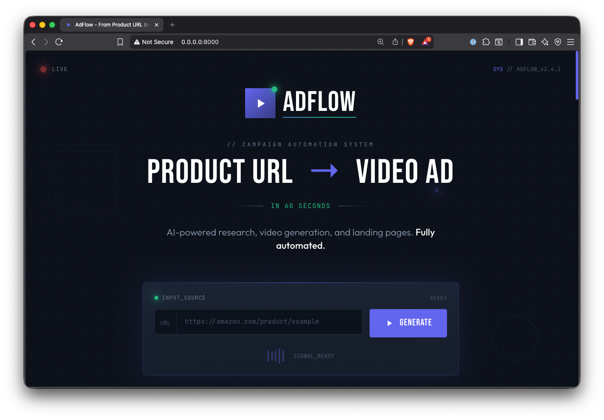
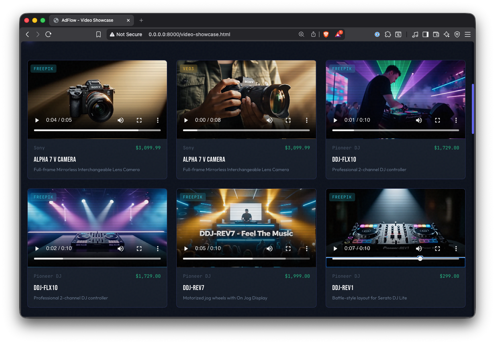
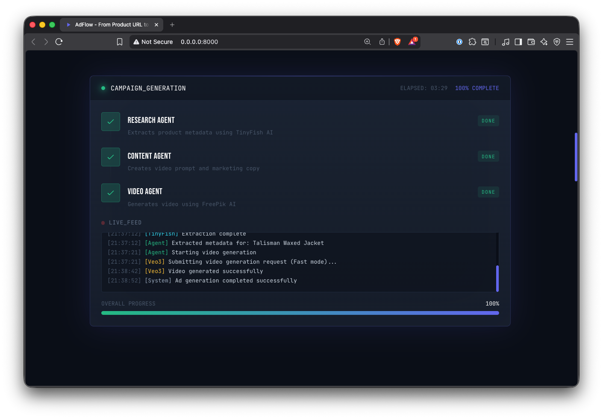
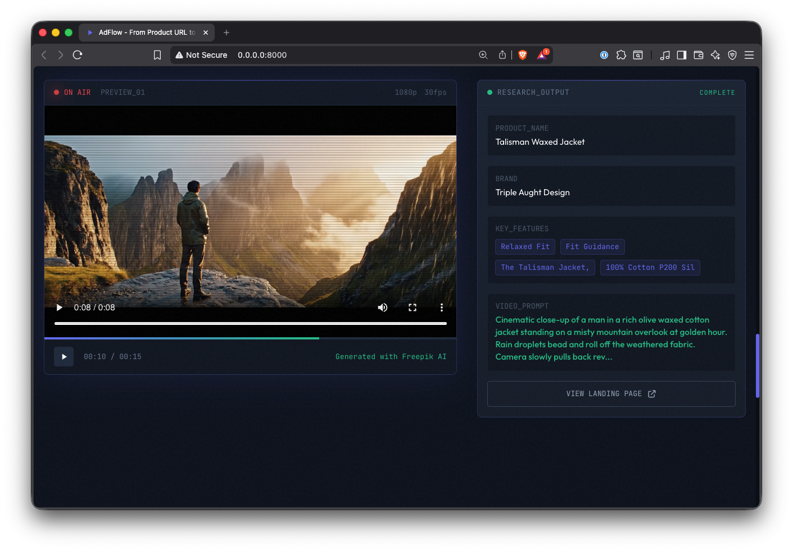

# Ad Generator

Generate video advertisements from product pages using Claude Agent SDK and AI video generation APIs.

## Screenshots

### Main Interface


### Video Showcase


### Agent Progress


### Video Showcase


## Featured Video Ads

Examples of AI-generated video advertisements:

<table>
  <tr>
    <td align="center">
      <video src="output/www.apple.com_apple-vision-pro/veo3_2c359982e55a7eb1d1e2a29f3d4a8162.mp4" width="280" controls></video>
      <br><b>Apple Vision Pro</b>
    </td>
    <td align="center">
      <video src="output/pioneerdjstore.com_products_ddj-xp2/veo3_cfcb01132ca44ef15c0e0d443a12f1e5.mp4" width="280" controls></video>
      <br><b>Pioneer DDJ-XP2</b>
    </td>
    <td align="center">
      <video src="output/patagonia.com_product_womens-r1-air-fleece-midlayer-full-zip-hoody_40261.html/freepik_6580f739-edb2-4c8f-9755-93e881f52746.mp4" width="280" controls></video>
      <br><b>Patagonia R1 Fleece</b>
    </td>
  </tr>
  <tr>
    <td align="center">
      <video src="output/www.hermes.com_us_en_product_l-esprit-s-envole-scarf-90-H004300Sv03/freepik_cf86c02b-51cf-49dd-982b-b9c6169e113b.mp4" width="280" controls></video>
      <br><b>Hermes Scarf</b>
    </td>
    <td align="center">
      <video src="output/ilce7m5mb-20260116-140552/veo3_6e0a1b7a3737d6bdc512aebb23bee258.mp4" width="280" controls></video>
      <br><b>Sony Alpha 7 V</b>
    </td>
    <td align="center">
      <video src="output/www.bmwusa.com_legacy-vehicles_i8.html/freepik_7b765817-57f4-4395-ad7a-6f7b029f5a2f.mp4" width="280" controls></video>
      <br><b>BMW i8</b>
    </td>
  </tr>
</table>

View all generated videos at the [Video Showcase](http://localhost:8000/video-showcase.html) when running locally.

## Overview

This tool takes a product detail page URL as input and automatically:
1. Extracts product metadata (title, description, images, price, brand)
2. Uses Claude to craft a compelling ad script and video prompt
3. Generates a short video advertisement using AI video generation

## Supported Video Models

| Provider | Model | Cost (5-sec) | Via |
|----------|-------|--------------|-----|
| Kie.ai | Veo 3 Fast | ~$0.40 | Default |
| Kie.ai | Veo 3 Quality | ~$2.00 | `--veo3-quality` flag |
| FreePik | WAN 2.6 | ~$0.50 | `--freepik` flag |

## Installation

### Prerequisites

- Python 3.10+
- Claude Code CLI (for authentication)
- Kie.ai API key (for Veo 3 - default model)
- FreePik API key (optional, for `--freepik` flag)

### Setup

1. Clone the repository:
```bash
git clone <repo-url>
cd agentic-orchestration
```

2. Create and activate a virtual environment:
```bash
python3 -m venv .venv
source .venv/bin/activate  # On Windows: .venv\Scripts\activate
```

3. Install dependencies:
```bash
pip install -e .
```

4. Set up environment variables:
```bash
cp .env.example .env
# Edit .env and add your API keys
```

5. Authenticate Claude Code (if not already):
```bash
claude
# Follow the prompts to authenticate
```

## Usage

### Web Interface

Start the web server to use the browser-based interface:

```bash
ad-generator-server
```

This starts a FastAPI server at http://localhost:8000 with:
- Web UI for submitting product URLs and tracking progress
- REST API at `/api/generate`, `/api/status/{job_id}`, `/api/jobs`
- Video showcase at `/video-showcase.html`

### CLI

```bash
# Basic usage (Veo 3 Fast - default, 5s video)
ad-generator "https://example.com/product/123"

# With Veo 3 Quality (higher quality, slower, more expensive)
ad-generator "https://example.com/product/123" --veo3-quality

# Also generate with FreePik WAN 2.6
ad-generator "https://example.com/product/123" --freepik

# Specify duration (5, 8, 10, or 15 seconds)
ad-generator "https://example.com/product/123" -d 10

# Specify output directory
ad-generator "https://example.com/product/123" --output ./my-ads

# Force regeneration (skip duplicate check)
ad-generator "https://example.com/product/123" --force
```

## Output Structure

Each generation creates a timestamped directory with the product name:

```
output/
└── macbook-air-13-inch-m4-2025-20260116-132438/
    ├── README.md                    # Generation details and prompt
    ├── freepik_<task-id>.mp4        # FreePik WAN 2.6 video
    └── veo3_<task-id>.mp4           # Veo 3 video (if --veo3)
```

The README.md contains:
- Input product URL
- Product information
- Video generation prompt
- Links to generated videos

## Deduplication

The tool automatically detects if a video has already been generated for a URL by scanning existing README.md files. Use `--force` to regenerate.

## Environment Variables

| Variable | Required | Description |
|----------|----------|-------------|
| `KIE_API_KEY` | Yes | Kie.ai API key for Veo 3 (default model) |
| `ANTHROPIC_API_KEY` | No | Anthropic API key (optional if using Claude Code auth) |
| `FREEPIK_API_KEY` | For --freepik | FreePik API key for WAN 2.6 |

## Project Structure

```
src/ad_generator/
├── __init__.py
├── main.py               # CLI entry point
├── agent.py              # Claude Agent orchestration
├── metadata_extractor.py # Product page scraping
├── freepik_client.py     # FreePik API client
├── kie_client.py         # Kie.ai API client (Veo 3)
└── models.py             # Pydantic data models
```

## How It Works

1. **Metadata Extraction**: Fetches the product page and extracts structured data using:
   - JSON-LD (schema.org Product)
   - Open Graph meta tags
   - Standard HTML elements

2. **Claude Agent**: An AI agent analyzes the product and creates:
   - Ad concept and script
   - Optimized video generation prompt

3. **Video Generation**: The prompt is sent to configured video generation APIs

## Development

Install dev dependencies:
```bash
pip install -e ".[dev]"
```

Run tests:
```bash
pytest
```

## Deployment

For production deployment to Vercel, see [VERCEL.md](VERCEL.md) for step-by-step instructions including:
- Vercel account setup
- Environment variable configuration
- Deployment process
- Testing and troubleshooting

## License

MIT
